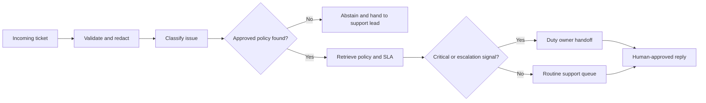

# Customer Service Agent

[](https://github.com/magicyao2028-pixel/customer-service-agent/actions/workflows/ci.yml)
[](LICENSE)

> 中文介绍：这是一个面向中小企业客服转型的离线 Agent 工作流原型。它对客户工单进行敏感信息脱敏、问题分类、政策检索、优先级与时限判断，并生成带政策引用的回复草稿和人工交接包。安全事件和明确升级信号必须转交人工；没有匹配政策时主动停止，而不是编造答案。公开版使用合成工单和政策，不连接真实客服平台、不调用付费 API，也不声称已经替代人工客服。

**Live prototype:** https://magicyao2028-pixel.github.io/customer-service-agent/

## Project context

This portfolio edition documents an AI application and Agent-product practice explored in the business context of **Changsha Shiju Trading Co., Ltd.** It shows how customer-service operations can become a controlled, reviewable workflow rather than a generic chatbot. All public tickets and policies are synthetic.

## Business problem

Small support teams receive order, delivery, refund and safety questions across chat, email and marketplace channels. Triage quality varies, policy evidence is often missing, sensitive data may be copied into notes, and urgent cases can be delayed. This prototype demonstrates one bounded workflow that:

- validates and sanitizes a ticket before classification;
- removes email, payment-card and password text from downstream output;
- matches the request to an approved local policy;
- tracks explicit conversation states and requests a missing order ID for at most two turns;
- attaches required evidence, resolution steps, owner and SLA;
- escalates critical or explicitly triggered cases to a human;
- abstains when no policy supports a response;
- creates a response draft that still requires human approval.

## What this repository demonstrates

| Capability | Evidence |
| --- | --- |
| AI product requirements | [PRD](docs/PRD.md), users, requirements, boundaries and release gate |
| Agent workflow | Explicit state transitions, bounded clarification, policy retrieval and handoff |
| Grounded customer service | Exact policy IDs, update dates, evidence lists and response ownership |
| Safety and privacy | Sensitive-data redaction, critical escalation and no-policy abstention |
| Engineering evidence | Typed Python package, two CLIs, 16 tests and deterministic 5/5 fixture |
| Product experience | Zero-cost [browser prototype](site/) showing triage and handoff states |

## Core workflow



The implementation is deterministic and keyword-based. It is an Agent workflow because it coordinates validation, privacy, policy retrieval and handoff tools; it is not presented as an LLM or a production conversational AI system.

## Quick start

Requirements: Python 3.10 or later. No third-party runtime dependency is required.

```bash
python -m pip install -e .
service-agent data/sample_ticket.json --output output/triage_result.json
service-conversation data/sample_conversation.json --output output/conversation_result.json
service-agent-eval
python -m unittest discover -s tests -v
```

To run without installation:

```bash
PYTHONPATH=src python -m customer_service_agent.cli data/sample_ticket.json
```

To view the static prototype locally:

```bash
python -m http.server 8000 --directory site
```

Then visit `http://localhost:8000`.

## Sample output

The synthetic damaged-product ticket is classified under `POL-RET-001`. The output includes required photo evidence, a 240-minute service target, a response draft, an owner and a five-step execution trace. See [`examples/sample_triage_result.json`](examples/sample_triage_result.json).

The bounded conversation example starts without an order ID, enters `needs_clarification`, receives the structured ID on turn one and then moves to `triaged`. See [`examples/sample_conversation_result.json`](examples/sample_conversation_result.json).

The public fixture covers damaged products, delivery delays, safety incidents, refunds and unsupported requests. Its 5/5 result is regression evidence for those engineered cases, not a production accuracy estimate. See the [evaluation report](examples/evaluation_report.md).

## Honest boundaries

- English keyword matching is not semantic understanding.
- Four synthetic policies do not represent a complete service knowledge base.
- Response drafts are not sent automatically and require human approval.
- Redaction covers selected common patterns, not every form of personal information.
- Conversation state is in memory only; there is no database, authentication, queue, integration or production deployment.
- No claim is made about reduced handling time, customer satisfaction or classification accuracy.

## Documentation

- [Product requirements](docs/PRD.md)
- [Business workflow](docs/BUSINESS_FLOW.md)
- [System architecture](docs/ARCHITECTURE.md)
- [Evaluation plan](docs/EVALUATION.md)
- [Security and governance](docs/SECURITY.md)
- [Maintenance plan](docs/MAINTENANCE_PLAN.md)
- [Current handoff](HANDOFF.md)
- [Changelog](CHANGELOG.md)

## Roadmap

- v0.1: grounded triage, redaction, policy citations, escalation, abstention and static demo;
- v0.2: explicit multi-turn conversation state and a two-turn clarification limit;
- v0.3: policy-conflict and freshness handling;
- v0.4: feedback replay and service-quality evaluation;
- v0.5: optional local/model adapter behind the deterministic safety boundary;
- v1.0: controlled private pilot with authenticated support users.

## License

MIT License. See [LICENSE](LICENSE).
