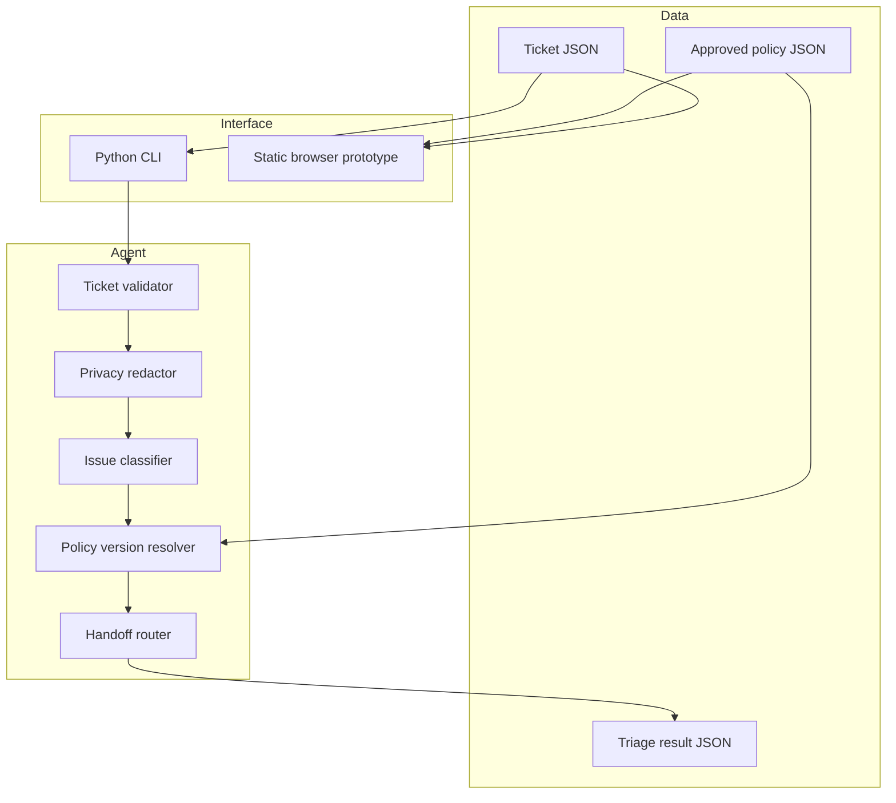

# System Architecture

## v0.3 design goals

- zero paid runtime dependency;
- privacy filtering before policy matching;
- policy-grounded responses with visible citations;
- deterministic policy-version resolution using effective, review-due and supersession metadata;
- safe blocking when policy categories conflict, all versions are stale or multiple current versions remain;
- explicit abstention and human handoff;
- explicit in-memory states with no more than two clarification turns;
- synthetic public evidence only.

## Logical architecture

## Component responsibilities

| Component | Responsibility |
| --- | --- |
| `models.py` | Validate ticket and policy structures. |
| `privacy.py` | Redact selected email, payment-card and password patterns. |
| `agent.py` | Orchestrate classification, policy evidence, SLA and handoff. |
| `policy_resolution.py` | Select one current unsuperseded version or return a reviewable block reason. |
| `conversation.py` | Track transitions, sanitize every turn and stop clarification after two replies. |
| `evaluation.py` | Run deterministic behavior fixtures and write reports. |
| `cli.py` | Provide local ticket input and JSON output. |
| `site/` | Demonstrate supported, escalated and unsupported states without a server. |

## Future production architecture

A later service may add authenticated ticket storage, role-based policy access, persistent conversations, queues, ticketing connectors, audit events, quality monitoring and an optional grounded model adapter. None is implemented in v0.3.
