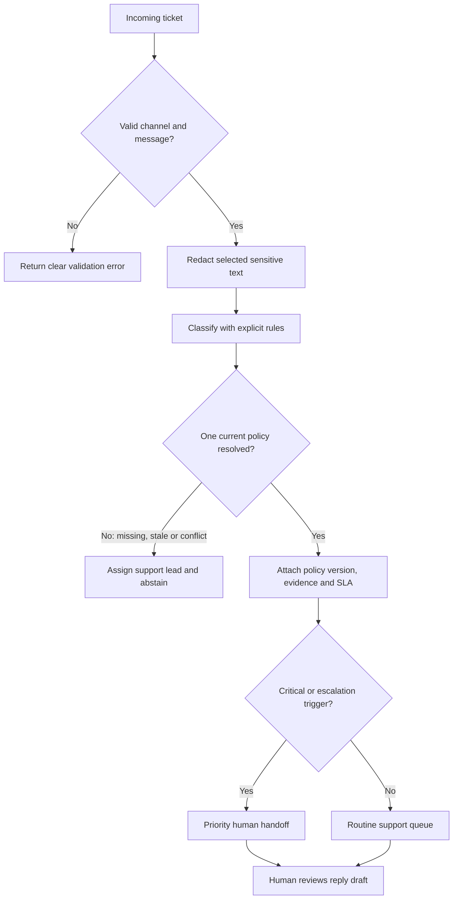

# Business Workflow

## Role boundaries

| Role | Responsibility |
| --- | --- |
| Customer Service Agent workflow | Sanitizes, classifies, retrieves policy and prepares the packet. |
| Support specialist | Verifies evidence, edits the draft and owns the customer interaction. |
| Duty manager | Reviews safety, fraud or explicit escalation cases. |
| Policy owner | Maintains policy content, categories, evidence and SLAs. |
| Authorized business owner | Approves refunds, compensation and other high-impact actions. |

The workflow never sends a reply, promises a refund or makes a medical conclusion.

Policy owners must provide effective dates, review deadlines and explicit supersession links. A policy conflict is treated as a governance exception, not as permission for the Agent to guess.
